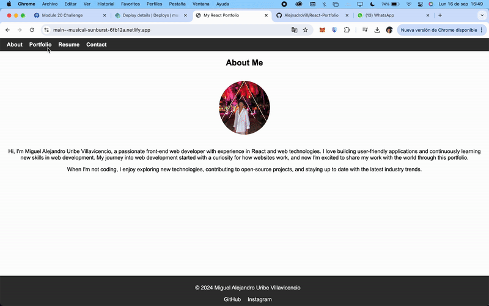

# React Portfolio

## Description

I created this portfolio using React to showcase my development skills and projects. This single-page application highlights my work and provides a professional introduction. The portfolio includes sections for About Me, Portfolio, Contact, and Resume, and is fully deployed on Netlify.

## User Story

AS A developer showcasing my skills and experience  
I WANT to create a single-page React portfolio  
SO THAT potential employers can view my work samples, assess my abilities, and consider me for job opportunities

## Technologies Used

- **React**: For building the user interface
- **React Router**: For navigation between sections
- **Netlify**: For deployment

## View my portfolio

1. You can try the app on here: <https://main--musical-sunburst-6fb12a.netlify.app/>

## Visual reference of project

The following image demonstrates the app's appearance:

## License

This project uses the MIT license.
